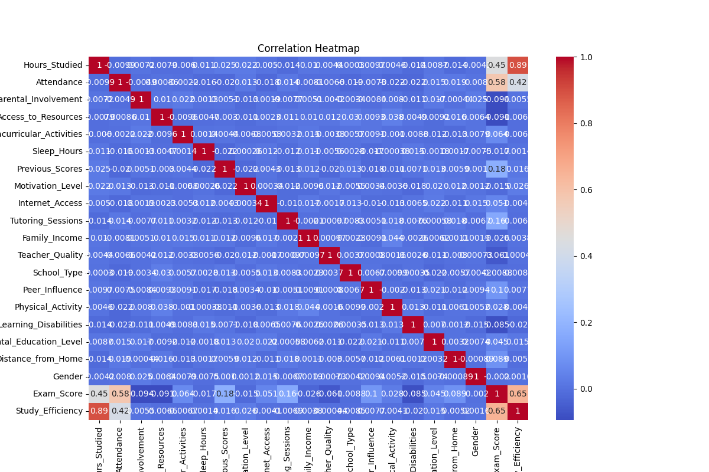
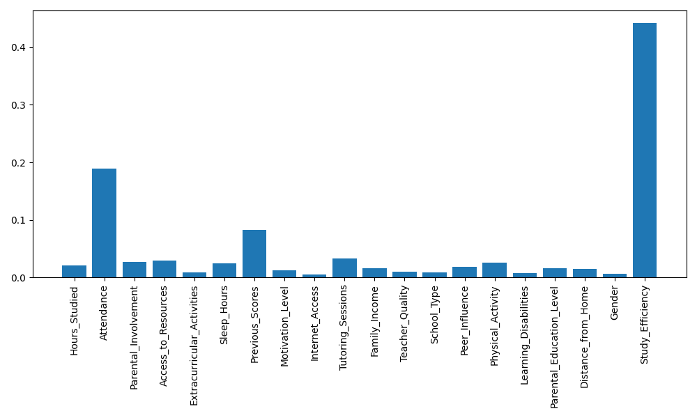
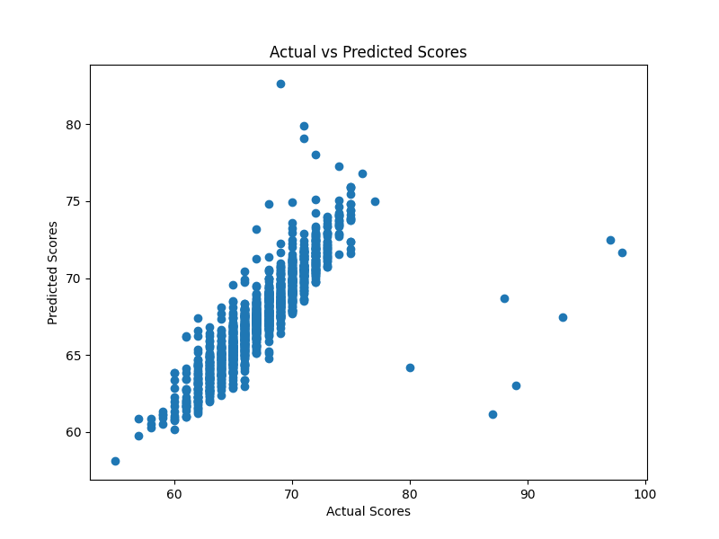

## Workflow

1. Load raw dataset
2. Clean missing data
3. Encode categorical variables
4. Create additional features
5. Train Random Forest model
6. Evaluate prediction accuracy
7. Save trained modelimport seaborn as sns

## Results

### Correlation Heatmap

### Feature Importance

### Prediction Results

